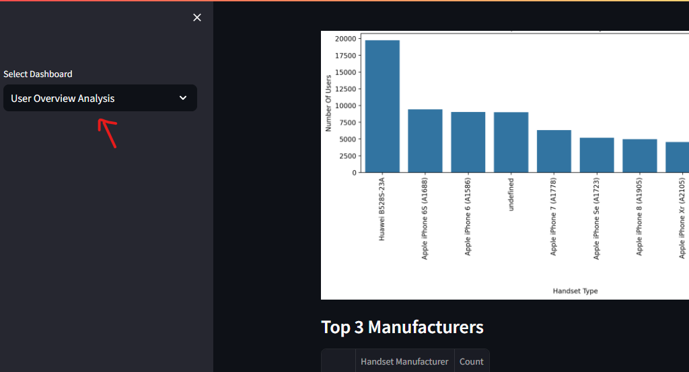

# Telecom User Analysis Project

This project is a comprehensive analysis of telecom user data, including user overview, engagement, experience, and satisfaction. It utilizes Python, Streamlit, PostgreSQL, and various data analysis and visualization libraries.

## Project Structure

- `telecom_user_analysis/`
 - `dashboard/` - Contains Streamlit dashboards for data visualization
 - `data/` - Handles PostgreSQL connection and data fetching
 - `models/` - Performs data analysis and modeling
 - `utils/` - Utility functions for data preprocessing and handling
 - `visualizations/` - Generates visualizations using Seaborn and Matplotlib
 - `tests/` - Contains test cases for various components

## Key Components

1. **User Overview**
2. **User Engagement**
3. **User Experience**
4. **User Satisfaction**

## Requirements

- Python 3.x
- PostgreSQL (for data storage)
- Additional Python libraries (listed in `requirements.txt`)

## Setup and Usage

1. Clone the repository: `git clone https://github.com/your-repo/telecom-user-analysis.git`
2. Install the required Python packages: `pip install -r requirements.txt`
3. Set up the PostgreSQL database and configure the connection details.
4. Run 
    streamlit run .\app.py

    

    select key component from the side bard, user overview,user engagment ...

## Contributing

Contributions to this project are welcome. Please follow the standard GitHub workflow:

1. Fork the repository
2. Create a new branch for your feature or bug fix
3. Commit your changes
4. Push to your forked repository
5. Submit a pull request

## License

